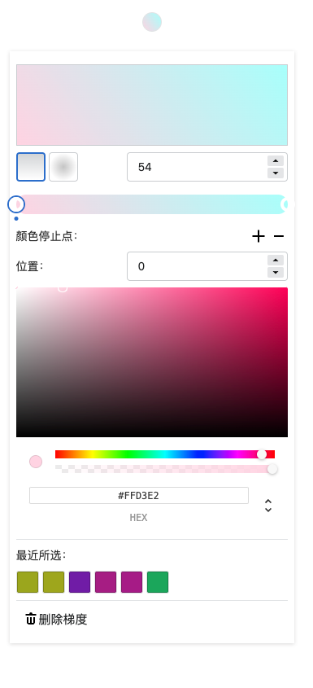

# [React Gradient Color](https://github.com/CiroMzy/react-gradient-color/)

### 功能展示
 [演示链接](http://mazhaoyang.cn/demos/react-gradient-color)


- 内置多个默认颜色，可直接选择


- 自由切换 gradientType
- 添加颜色停止点
- 每个点位置调整
- 颜色选取
- 历史选取记录
- 点击删除梯度，重新选择




### 环境介绍
- 基于react
- 基于react color


### 运行
- 启动
```
> $ npm run dev
```

- 打包

```
> $ npm run build
```


